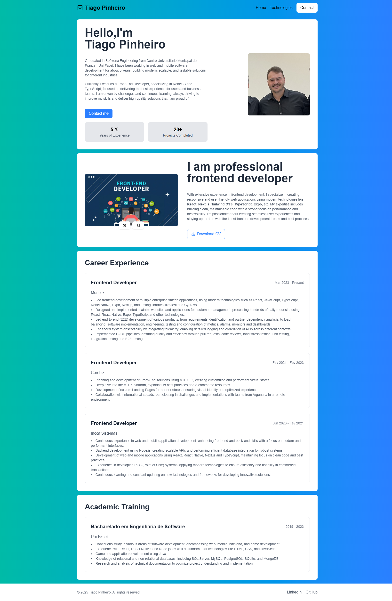
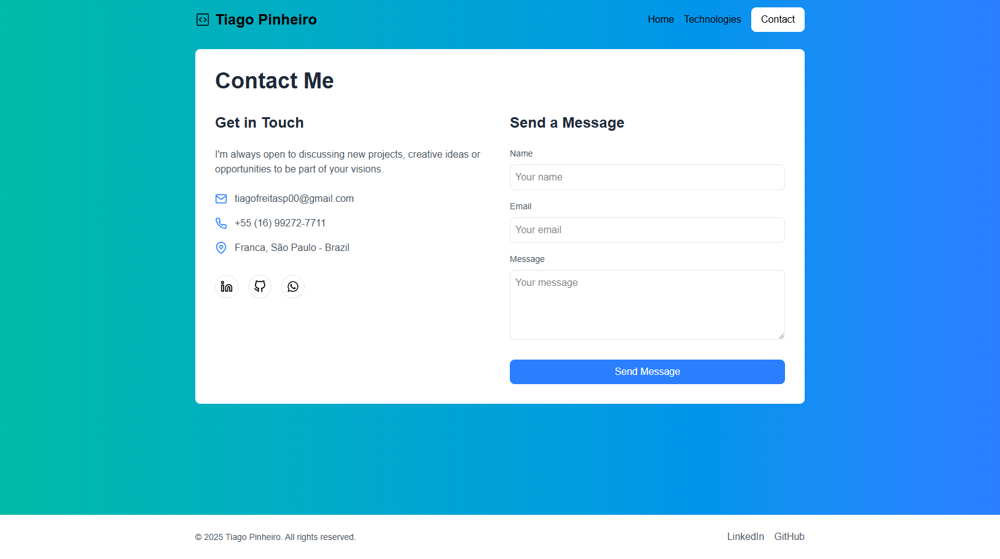

# My Next.js Portfolio

This is a [Next.js](https://nextjs.org) project bootstrapped with [`create-next-app`](https://nextjs.org/docs/app/api-reference/cli/create-next-app).

## Project Images

Here are some images showcasing the project:


*HomePage*


*HomePage*


*My Technologies*

## Technologies Used

This project utilizes the following technologies:

- **Next.js**: A React framework for building server-side rendered applications. [Learn more](https://nextjs.org)
- **React**: A JavaScript library for building user interfaces. [Learn more](https://reactjs.org)
- **TypeScript**: A typed superset of JavaScript that compiles to plain JavaScript. [Learn more](https://www.typescriptlang.org)
- **Tailwind CSS**: A utility-first CSS framework for styling. [Learn more](https://tailwindcss.com)
- **Geist**: A modern font family optimized for Vercel. [Learn more](https://geist-ui.dev)
- **Vercel**: The platform for deploying Next.js applications. [Learn more](https://vercel.com)
- **React Icons**: A library for including popular icons in React applications. [Learn more](https://react-icons.github.io/react-icons/)

## Getting Started

To get started with this project, follow these steps:

1. **Clone the repository**:

   ```bash
   git clone <repository-url>
   cd <repository-name>
   ```

2. **Install dependencies**:

   You can use npm, yarn, pnpm, or bun to install the dependencies:

   ```bash
   npm install
   # or
   yarn install
   ```

3. **Run the development server**:

   Start the development server with one of the following commands:

   ```bash
   npm run dev
   # or
   yarn dev
   ```

4. **Open your browser**:

   Navigate to [http://localhost:3000](http://localhost:3000) to see the result.

## Editing the Project

You can start editing the page by modifying `app/page.tsx`. The page auto-updates as you edit the file.

## Learn More

To learn more about Next.js, take a look at the following resources:

- [Next.js Documentation](https://nextjs.org/docs) - Learn about Next.js features and API.
- [Learn Next.js](https://nextjs.org/learn) - An interactive Next.js tutorial.

You can check out [the Next.js GitHub repository](https://github.com/vercel/next.js) - your feedback and contributions are welcome!

## Deploy on Vercel

The easiest way to deploy your Next.js app is to use the [Vercel Platform](https://vercel.com/new?utm_medium=default-template&filter=next.js&utm_source=create-next-app&utm_campaign=create-next-app-readme) from the creators of Next.js.

Check out our [Next.js deployment documentation](https://nextjs.org/docs/app/building-your-application/deploying) for more details.
